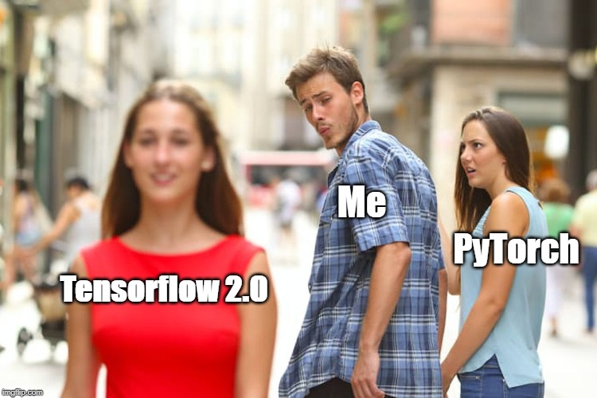

# Tensorflow 2.0 playground

  

This is the repo for working with nerual networks with Tensorflow 2.0 beta.

CPU only version installation:  
```bash
!pip install -q tensorflow==2.0.0-beta1
```

GPU version please consult [GPU Guide](https://www.tensorflow.org/install/gpu)

## Contents
### Stand alone examples
1. `dataset == MNIST`
    + [subclass model with eager execution mode in custom loop](mnist_mlp_eager.py)
    + [above + `@tf.function` decorator](mnist_mlp_function.py)
    + [above with `tf.keras.Sequential` model](mnist_mlp_keras_sequential.py)
    + [above with `tf.keras` `.fit` api](mnist_mlp_pure_keras.py)
    + [metric learning with additive angular margin loss](mnist_metric_learning.py)  
     Reference: [ArcFace: Additive Angular Margin Loss for Deep Face Recognition](https://arxiv.org/abs/1801.07698)
2. `dataset == cifar10`
    + [simple cnn model](cifar10_cnn.py)
    + [above with mixup](cifar10_cnn_mixup.py)   
    Reference: [mixup: Beyond empirical risk minimization](https://arxiv.org/abs/1710.09412)
    + [above with ict](cifar10_cnn_ict.py)   
    Reference: [Interpolation Consistency Training for Semi-Supervised Learning](https://arxiv.org/abs/1903.03825)
3. `dataset == titanic`
    + [unsupervised categorical feature embedding](titanic_cat_embd_ae.py)

### Tutorial Notebooks
1. [Tensorflow basics](notebooks/01_basics.ipynb)

### Convolutional Neural Networks
| Model | Reference | Year |
|-------|-----------|------|
| [AlexNet](convnets/alexnet.py) | [ImageNet Classification with Deep Convolutional Neural Networks](http://papers.nips.cc/paper/4824-imagenet-classification-with-deep-convolutional-neural-networks.pdf) | 2012 |
| [VGG](convnets/vgg.py) | [Very Deep Convolutional Networks for Large-Scale Image Recognition](https://arxiv.org/abs/1409.1556) | 2014 |
| [GoogleNet](convnets/googlenet.py) | [Going Deeper with Convolutions](https://arxiv.org/abs/1409.4842) | 2015 |
| [ResNet](convnets/resnet.py) | [Deep Residual Learning for Image Recognition](https://arxiv.org/abs/1512.03385) | 2016 |
| [WideResNet](convnets/resnet) | [Wide Residual Networks](https://arxiv.org/abs/1605.07146) | 2016 |
| [SqueezeNet](convnets/squeezenet.py) | [SqueezeNet: AlexNet-level accuracy with 50x fewer parameters and <0.5MB model size](https://arxiv.org/abs/1602.07360) | 2016 |
| [DenseNet](convnets/densenet.py) | [Densely Connected Convolutional Networks](https://arxiv.org/abs/1608.06993) | 2017 |
| [ResNeXt](convnets/resnet.py) | [Aggregated Residual Transformations for Deep Neural Networks](https://arxiv.org/abs/1611.05431) | 2017 |
| [SEResNeXt](convnets/resnet.py) | [Squeeze-and-Excitation Networks](https://arxiv.org/abs/1709.01507) | 2018 | 
| [MobileNetV2](convnets/mobilenetv2.py) | [MobileNetV2: Inverted Residuals and Linear Bottlenecks](https://arxiv.org/abs/1801.04381) | 2018 |
| [ShuffleNetV2](convnets/shufflenetv2.py) | [ShuffleNet V2: Practical Guidelines for Efficient CNN Architecture Design](https://arxiv.org/abs/1807.11164) | 2018 |
| [MnasNet](convnets/mnasnet.py) | [MnasNet: Platform-Aware Neural Architecture Search for Mobile](https://arxiv.org/abs/1807.11626) | 2019 |

### Sequence Models
| Model | Reference | Year |
|-------|-----------|------|
| [Transformer](sequence/transformer.py) | [Attention Is All You Need](https://arxiv.org/abs/1706.03762) | 2017 |

### Graph Neural Networks
| Model | Reference | Year |
|-------|-----------|------|
| [MPNN](graph/mpnn.py) | [Neural Message Passing for Quantum Chemistry](https://arxiv.org/abs/1704.01212) | 2017 |

### Factorization Machines
Implemented models    
See the [benchmark result](fm/benchmark.md) on how to use the benchmark runner to train these models on criteo dataset.    
  
| Model | Reference | Year |
|-------|-----------|------|
| [FM](fm/fm.py) | [Factorization Machines](https://ieeexplore.ieee.org/abstract/document/5694074) | 2010 |
| [FFM](fm/ffm.py) | [Field-aware factorization machines for CTR prediction](https://dl.acm.org/citation.cfm?id=2959134) | 2016 |
| [FNN](fm/fnn.py) | [Deep Learning over Multi-field Categorical Data: A Case Study on User Response Prediction](https://arxiv.org/abs/1601.02376) | 2016 |
| [AFM](fm/afm.py) | [Attentional Factorization Machines: Learning the Weight of Feature Interactions via Attention Networks](https://arxiv.org/abs/1708.04617) | 2017 | 
| [DeepFM](fm/dfm.py) | [DeepFM: A Factorization-Machine based Neural Network for CTR Prediction](https://arxiv.org/abs/1703.04247) | 2017 |
| [NFM](fm/nfm.py) | [Nerual Factorization Machines for Sparse Predictive Analytics](https://arxiv.org/abs/1708.05027) | 2017 |
| [xDeepFM](fm/xdfm.py) | [xDeepFM: Combining Explicit and Implicit Feature Interactions for Recommender Systems](https://arxiv.org/abs/1803.05170) | 2018 |
| [AutoInt](fm/afi.py) | [AutoInt: Automatic Feature Interaction Learning via Self-Attentive Neural Networks](https://arxiv.org/abs/1810.11921) | 2018 |
| [FNFM](fm/fnfm.py) | [Field-aware Neural Factorization Machine for Click-Through Rate Prediction](https://arxiv.org/abs/1902.09096) | 2019 |


